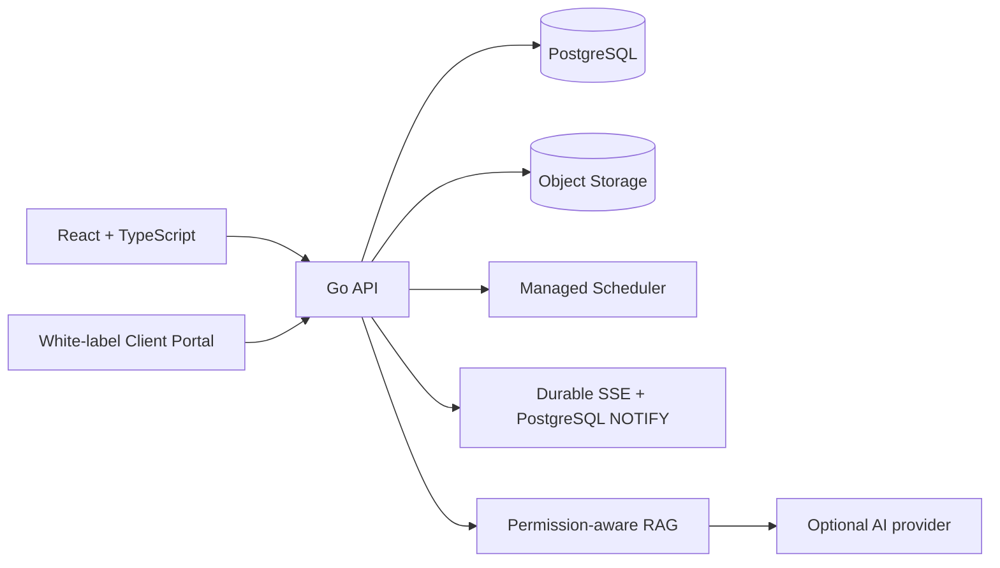
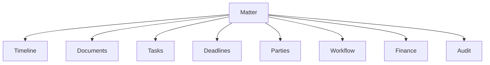
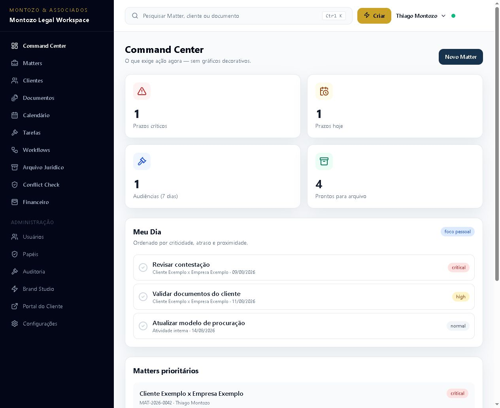
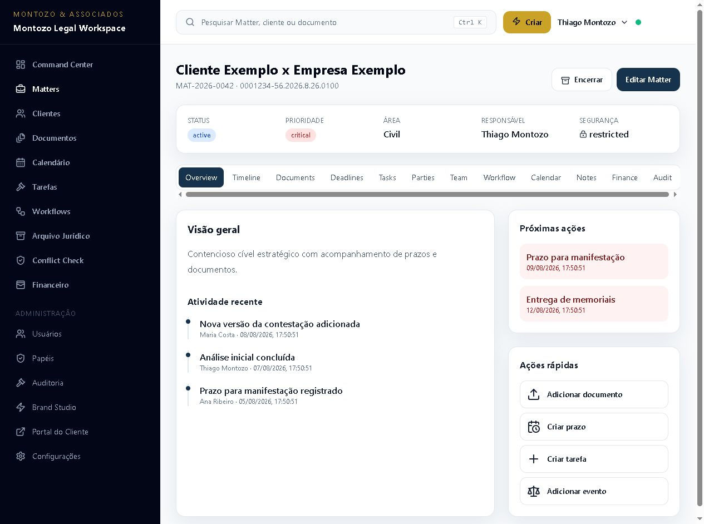
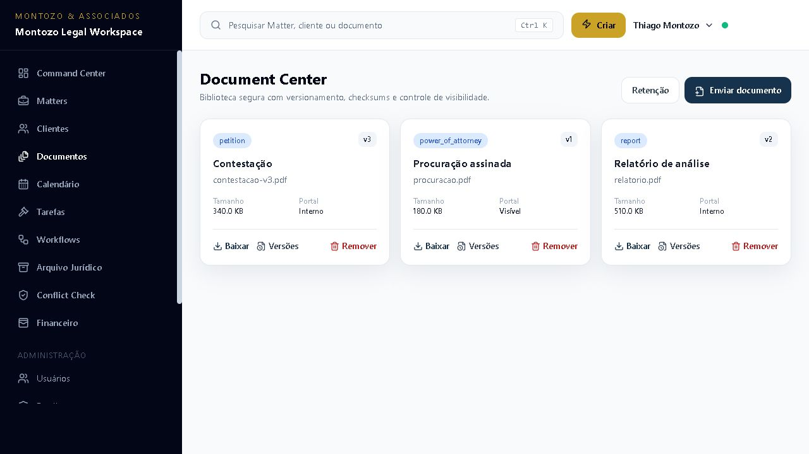
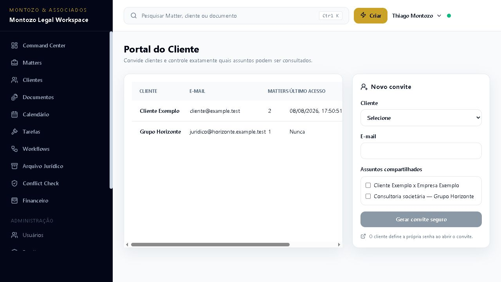

# LawOffice OS

[](https://github.com/thiagomontozo/lawoffice-os/actions/workflows/ci.yml)
[](https://github.com/thiagomontozo/lawoffice-os/actions/workflows/security.yml)
[](LICENSE)

> White-label legal practice management platform built with Go, React and TypeScript.

**Current status: Experimental.** LawOffice OS is a portfolio-grade systems and product engineering project. The repository now has initial automated tests and CI, but it is not production-ready and still requires deployment-specific security and operational validation.

## Overview

LawOffice OS is a customizable legal operations workspace for modern law firms. Instead of treating a lawsuit as an isolated record, it makes the broader **Matter** the operational center for clients, parties, files, deadlines, tasks, hearings, workflow, finance, history, access control and audit.

## Why LawOffice OS?

Legal work rarely fits into a single “process” table. A practice handles litigation, administrative proceedings, consultations, contracts, arbitration, advisory work and internal projects. Each has different confidentiality, workflow and closure requirements. LawOffice OS models those differences while retaining a coherent workspace.

## Product Vision

LawOffice OS is a **Legal Practice Operating System**: one modular product that a firm can shape around its visual identity, areas, Matter types, roles, custom fields, workflows, templates and client-facing experience.

## Key Differentiators

- **Brand Studio:** title, firm name, colors, logos, favicon, login background and client portal language.
- **White-label client portal:** controlled Matter, event and document sharing under the firm brand.
- **Matter-centric architecture:** judicial and non-judicial legal work share one adaptable model.
- **Legal Timeline:** chronological, attributable and optionally client-visible events.
- **Workflow Builder:** ordered stages, checklists, default responsibility and declarative entry tasks.
- **Conflict Check:** broad possible-match search with explicit human-decision boundaries.
- **Matter-level security:** normal, team-only, partners-only and restricted visibility with explicit grants.
- **Document versioning:** immutable file versions, checksums and historical download.
- **Structured archive workflow:** open-work warnings, closure metadata, search and controlled reopen.
- **Searchable Legal Archive:** archived work remains authorized, auditable and discoverable.
- **Command Center and Meu Dia:** action-oriented operational awareness.
- **Deep audit trail:** security and domain changes recorded without sensitive content.

## Architecture

The V0.1 is a modular monolith: a Go API owns business rules, PostgreSQL is the source of truth, filesystem object storage keeps binary files out of the database, and a React client presents internal and portal experiences.





See [architecture](docs/architecture.md) and [domain model](docs/domain-model.md).

## Interface Preview

The screenshots below use fictional demonstration data. No real client, legal or personal information is included.

### Command Center



### Matter workspace



### Document Center



### Client portal administration



## Technology Stack

- Backend: Go, Chi, pgx, `slog`, `context.Context`
- Frontend: React, TypeScript strict mode, Vite, React Router, Tailwind CSS
- Database: PostgreSQL with versioned SQL migrations
- Storage: local filesystem behind an `ObjectStorage` interface
- Document intelligence: asynchronous OCR, PostgreSQL retrieval, optional embeddings and Responses API generation
- Realtime: Server-Sent Events
- Deployment assets: multi-stage Dockerfiles and Docker Compose

## White-Label Brand Studio

Brand Studio persists the system title, displayed firm name, primary/secondary/accent colors, sidebar style, radius style, support details, portal title and welcome message. PNG, JPEG and WEBP assets can be uploaded for light/dark logos, favicon and login background. The frontend applies colors through `--brand-primary`, `--brand-secondary` and `--brand-accent` CSS variables. SVG is deliberately excluded in V0.1.

## Firm Isolation

Every relevant record carries `firm_id`. Repository queries scope by the authenticated firm and cross-entity foreign keys frequently use `(id, firm_id)` to prevent cross-firm references. IDs provided by the browser are never sufficient authorization by themselves.

## User Management

The initial setup creates an Owner. Administrators can add users, attach roles, disable/reactivate accounts and trigger session revocation. Passwords are bcrypt hashes and authenticated sessions use HMAC-hashed random tokens stored server-side.

## Roles and Permissions

Roles are data, not hardcoded application branches. A role can receive granular permissions for firm, branding, user, client, Matter, document, deadline, task, workflow, finance, audit, archive and portal operations.

## Matter-Level Security

Role permission answers “may this user perform this class of action?” Matter access answers “may this user see or modify this specific Matter?” Restricted Matters require an explicit user or role grant. Partner-only records also verify qualifying role membership on the backend.

## Matter Management

Supported Matter types include judicial and administrative processes, consultations, contracts, advisory work, arbitration, extrajudicial work and internal legal projects. Judicial fields live in an optional extension rather than burdening every Matter. Legal areas, types, tags, templates and moderate custom fields are firm-owned.

## Legal Timeline

Matter events record actor, timestamp, type, summary and related resource. Public portal visibility is explicit per event; internal events never become public merely because a client has Matter access.

## Document Management

Metadata belongs to PostgreSQL; content belongs to object storage. Uploads are streamed through size enforcement and SHA-256 calculation, storage keys are firm-prefixed and generated internally, filenames are never paths, and downloads repeat firm/Matter authorization. Each version records checksum, creator and notes; downloads are audited.

## Document Versioning

Uploading a new version never silently overwrites the prior object. The current pointer advances transactionally while older versions remain downloadable according to the same authorization boundary. Deletion is a reversible metadata action; physical purge is a separate retention decision that must account for legal hold.

## OCR and searchable document text

Every immutable document version receives an asynchronous extraction record. The built-in provider handles TXT, DOCX and XLSX; a bounded HTTPS provider contract supports scanned PDF and image OCR. Text is stored per page with confidence metadata and PostgreSQL full-text indexes. Users can inspect status, review extracted pages and explicitly reprocess the current version. The original file remains authoritative. See [OCR and document extraction](docs/ocr.md).

## Matter AI Workspace and RAG

Matter Detail includes a private question-and-answer workspace over authorized current document versions, with cited starting points for summaries, chronology drafts, date review and clause comparison. Extraction output is chunked with page/version lineage, PostgreSQL provides lexical candidates, and optional embeddings add bounded semantic reranking. The generator receives only selected source blocks, disables provider-side response storage, treats document text as untrusted evidence and returns source cards for professional review. Questions and answers are not persisted; audit stores only sanitized operational metadata. The feature is disabled by default. See [Matter AI Workspace and RAG](docs/ai-workspace.md).

## Deadlines and Tasks

Deadlines support open/completed/cancelled states and operational urgency windows. Tasks may belong to a Matter or the firm, support assignee, priority and due date, and can later be created from workflow entry rules. V0.1 does **not** calculate procedural deadlines automatically.

## Calendar and Hearings

The calendar consolidates hearing, deadline, task and custom-event concepts with day, week, month and agenda views. External calendar providers are roadmap work.

## Workflow Builder

Workflows define ordered stages, colors, descriptions, checklists, default roles and declarative tasks created upon stage entry. This intentionally avoids a general scripting engine or full BPMN complexity.

## Matter Templates

Templates can preselect Matter type, legal area, workflow, folders, tasks, tags and custom-field defaults, allowing repeatable firm-specific intake.

## Conflict Check

Conflict Check searches active and archived clients, contacts, opposing or related parties and Matter titles. Its result says **Possible conflict**, never a legal conclusion. False positives and name collisions require professional review.

## Legal Archive

Closing computes warnings for open tasks, deadlines, future hearings and financial items. Authorized users may proceed while preserving warning counts and closure metadata. Archived Matters stay searchable and can be reopened with a reason and audit event.

## Financial Tracking

Matter finance tracks fees, expenses, court costs, reimbursements, success fees and payments in integer cents. Summaries are operational and must not be treated as official accounting.

## Command Center

The dashboard prioritizes critical/today deadlines, hearings, assigned tasks, recent documents, Matter activity, high-priority Matters and archive readiness. “Meu Dia” narrows work to the authenticated user.

## Global Search

The persistent search and Ctrl/Cmd+K command palette rank and group authorized results for Matter titles, internal/case numbers, clients, contacts, documents, parties and tags. PostgreSQL trigram indexes and relevance scoring remain behind a replaceable search boundary without weakening firm or Matter permissions.

## Client Portal

Portal users have separate credentials and sessions. An administrator creates a 72-hour, single-use invitation and the client defines their own password. With SMTP enabled, invitations are delivered by an encrypted durable job queue; otherwise the authorized administrator receives a manual link. Password recovery uses a non-enumerating response and a one-hour, single-use token, then revokes existing portal sessions. A `PortalAccess` grant links that identity to selected Matters and defines shareable summary, timeline and appointments. Documents and events need an explicit `clientVisible` flag, downloads repeat authorization checks, revocation invalidates existing sessions, and the portal uses firm branding.

## Audit Trail

Important authentication, administration, Matter, document, branding, archive and finance events record firm, actor, action, resource, request context and sanitized metadata. Passwords, tokens, authorization headers and file contents are excluded.

## Security Model

Security is layered: authentication → firm isolation → RBAC → Matter authorization → document authorization → portal authorization. Strict HttpOnly cookies, origin checks, sensitive-endpoint rate limits and browser security headers harden the HTTP boundary. Uploads are size/MIME limited and stored under generated keys. Sensitive records use soft deletion. CodeQL, Go vulnerability analysis, npm audit and Dependabot provide continuous repository checks. See [security model](docs/security-model.md).

## Privacy-Oriented Design

The architecture includes privacy-oriented controls, but legal compliance depends on deployment, configuration and organizational processes. Access control, audit, data isolation, session revocation, minimal logging and export foundations help support responsible operation; they do not automatically establish LGPD compliance.

## Getting Started

### Requirements

- Go 1.25+
- Node.js 24+
- PostgreSQL 17+
- Docker Compose is optional

### First access and office registration

1. Copy `.env.example` to `.env` and replace `SESSION_SECRET`. In production it must contain at least 32 characters and must not be `change-me`.
2. Create the PostgreSQL database and start the backend from `backend/`. Migrations run on API startup.
3. Start the frontend from `frontend/`.
4. Open `http://localhost:5173/setup` (or `http://localhost:3000/setup` with Compose).
5. Complete the setup wizard: office details → visual identity → administrator → initial legal structure → finish.
6. The first administrator is assigned the **Owner** role. The wizard also creates default legal areas, Matter types and a starter workflow.
7. Future access uses `/login` with three values: **firm slug**, administrator e-mail and password.

After login, a practical first-use path is:

1. Open **Brand Studio** and upload the firm logo/favicon.
2. Review **Roles** and create the internal users.
3. Run **Conflict Check** for the prospective client.
4. Register the client and create a Matter.
5. Add parties, deadlines, tasks and document versions from Matter Detail.
6. Configure a workflow and, when appropriate, open **Portal do Cliente**, select a client and the Matters to share, then send the one-time invitation link through a trusted channel.

No real legal data should be used until deployment security, backups and validation are reviewed.

## Configuration

| Variable | Purpose | Default/example |
|---|---|---|
| `APP_ENV` | `development` or `production` | `development` |
| `API_PORT` | API listener | `8080` |
| `DATABASE_URL` | PostgreSQL connection | see `.env.example` |
| `WEB_ORIGIN` | exact allowed browser origin | `http://localhost:5173` |
| `SESSION_SECRET` | session HMAC key | required |
| `METRICS_TOKEN` | optional bearer token enabling `/metrics` | disabled |
| `STORAGE_PATH` | local object root | `./data/storage` |
| `STORAGE_DRIVER` | `local` or S3-compatible `s3` adapter | `local` |
| `S3_*` | endpoint, bucket, credentials, region and TLS for S3/MinIO | disabled |
| `UPLOAD_SCAN_MODE` | `off` or fail-closed ClamAV `required` | `off` |
| `CLAMAV_ADDRESS` | ClamAV TCP service used for streaming scans | required by scan mode |
| `SMTP_*` | optional STARTTLS mail delivery for portal links | disabled |
| `JOB_ENCRYPTION_SECRET` | encryption key for queued one-time links | `SESSION_SECRET` fallback |
| `MAX_UPLOAD_MB` | upload limit, 1–100 | `25` |
| `LOG_LEVEL` | structured log level | `info` |
| `DEFAULT_LOCALE` | firm setup fallback | `pt-BR` |
| `DEFAULT_TIMEZONE` | firm setup fallback | `America/Sao_Paulo` |
| `OCR_*` | extraction mode/provider and bounded input/output controls | disabled |
| `AI_MODE` | off or optional OpenAI Matter provider | `off` |
| `OPENAI_API_KEY` | external provider credential; never committed | empty |
| `AI_MODEL`, `AI_EMBEDDING_MODEL` | configurable generation and embedding models | see `.env.example` |
| `AI_MAX_CONTEXT_CHARACTERS`, `AI_MAX_SOURCES`, `AI_TIMEOUT_SECONDS` | retrieval/provider resource bounds | `40000`, `8`, `60` |

## API

Health endpoints live at `/healthz` and `/readyz`. Business endpoints are versioned below `/api/v1`; cookie-based calls require credentials. See [API reference](docs/api.md).

## Database

The initial migration creates the multi-firm relational model, constraints, indexes and permission catalog. Money is integer cents; files are metadata only; soft-delete fields protect legal records. See [database notes](docs/database.md).

## Object Storage

`ObjectStorage` exposes `Put`, `Open`, `Delete` and `Health`. The local adapter enforces root confinement and atomic placement; the S3-compatible adapter supports managed S3 and MinIO without changing document business rules. Uploads can be scanned through ClamAV before an object is committed. Required scan mode fails closed and participates in readiness.

## Docker

The repository includes multi-stage backend/frontend Dockerfiles and a Compose topology for PostgreSQL, API, web and persistent document storage. CI builds both images. A local Compose validation requires Docker Desktop or another compatible daemon.

## Operations and Recovery

The API exposes liveness, dependency-aware readiness and an optional bearer-protected Prometheus endpoint. Versioned PowerShell scripts back up and restore PostgreSQL together with local document storage, including a manifest and SHA-256 integrity checks. See the [operations runbook](docs/operations.md) before defining recovery objectives or handling a production incident.

## Testing and CI

The repository validation includes:

- Go unit tests for password/session handling, configuration and local storage safety;
- PostgreSQL integration coverage for firm isolation, restricted Matter access and document authorization;
- Vitest coverage for the typed API client and standard error envelope;
- frontend type checking and production build;
- `go vet`, Go build and race-enabled tests;
- remote PostgreSQL and container builds in GitHub Actions.
- CodeQL extended analysis, Go vulnerability scanning, npm runtime dependency audit and Dependabot updates.

Run the local checks with:

```bash
cd backend
go vet ./...
go test ./...
go build -o ../.tools/lawoffice-api ./cmd/api

cd ../frontend
npm ci --ignore-scripts
npm run format:check
npm test
npm run build
```

Repository integration tests use `TEST_DATABASE_URL`. Without it they skip safely; CI always supplies an isolated PostgreSQL service.

## Project Structure

```text
backend/             Go modular monolith, migration runner and SQL migrations
frontend/            React/TypeScript workspace and white-label portal
docs/                Architecture, domain, security and decisions
scripts/             Backup and restore operations
Dockerfile.backend   Multi-stage API image
Dockerfile.frontend  Multi-stage static web image
compose.yml          PostgreSQL + API + web + persistent storage
```

## Design Decisions

Thirteen ADRs in [`docs/decisions`](docs/decisions) cover the stack, modular monolith, Matter domain, firm isolation, layered authorization, object storage, versioning, white label, SSE, structured archive and permission-aware RAG.

## Limitations

- The automated suite is intentionally focused on critical foundations and does not yet cover every handler or React interaction.
- SSE replay is durable for seven days and capped at 500 events per reconnect; clients that remain offline beyond that window must perform a full data refresh.
- Local object storage still assumes a single shared filesystem. S3/MinIO and ClamAV adapters are available, but document previews and asynchronous quarantine review are not.
- RAG semantic ranking is computed in Go over a bounded PostgreSQL candidate set; very large corpora may eventually require a permission-preserving vector index.
- SMTP supports invitations, password recovery and opt-in deadline/task alerts through the durable queue. Bounce handling, digest scheduling and per-field portal sharing controls are not yet available.
- The built-in abuse limiter is instance-local; production needs a distributed edge rate limiter. Metrics now provide a monitoring foundation, but alert delivery and dashboards remain deployment responsibilities.
- Scheduler notification rules are basic and do not calculate legal procedural deadlines.
- No SMS, external calendar provider, court connector, autonomous legal advice, SSO or SaaS billing.
- OCR quality depends on the configured provider. AI output can be incomplete or wrong and always requires source review; enabling an external provider requires a confidentiality and data-processing assessment.

## Roadmap

### v0.2

- broader handler, browser and accessibility test coverage
- richer notification preferences, digests and bounce handling
- richer custom fields
- PDF report generation
- improved global search
- advanced workflow automation
- document preview
- S3/MinIO adapter

### v0.3

- Google Calendar / Microsoft Calendar integration
- legal publication ingestion connectors
- tribunal integrations
- advanced deadline automation
- approval flows and document templates

### v0.4

- evaluated retrieval quality and citation-grounding datasets
- background document summaries and chronology drafts with approval
- scalable permission-aware vector indexing
- optional self-hosted model and embedding adapters

### v0.5

- multi-firm SaaS mode
- billing foundations
- advanced analytics
- enterprise SSO

The initial AI Workspace is deliberately assistive: no autonomous actions, cross-Matter retrieval, legal advice or automatic deadline calculation. Any future AI capability must preserve the same backend authorization and source-verification boundary.

## Contributing

Open an issue before large changes. Keep the modular monolith, firm-scoped queries, backend authorization, tests and documentation aligned. New behavior should include proportionate automated coverage and pass both CI and security workflows.

## License

MIT © 2026 Thiago Montozo. See [LICENSE](LICENSE).
