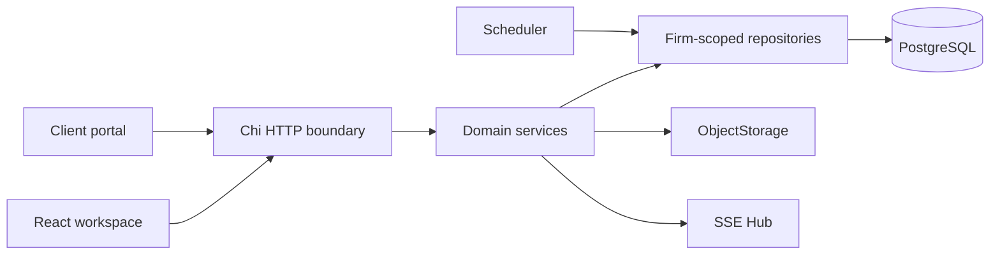

# Architecture

## Modular monolith

LawOffice OS is one deployable Go API organized by domain boundaries rather than a network of microservices. Identity, branding, clients, Matters, documents, deadlines, workflow, archive, search, finance, portal and audit share one transaction boundary and PostgreSQL source of truth. This keeps V0.1 operationally understandable while preserving module-level seams.

## Backend

Handlers decode bounded input and translate errors. Services enforce cross-resource rules such as Matter authorization and upload policy. Repositories own SQL and always receive `firmID`. Authentication middleware resolves a server-side session into a user plus roles/permissions. Domain objects remain independent of HTTP presentation.

The scheduler is one cancellation-aware goroutine for the entire process, not one goroutine per deadline. It scans near-term deadlines/tasks and creates idempotent internal notifications. SIGINT/SIGTERM cancels the scheduler, closes SSE, drains HTTP and then closes PostgreSQL.

## Frontend

React Router separates public login/setup, protected `/app` routes and `/portal`. An authentication context loads the user, firm and branding. CSS variables apply the firm palette. The app layout owns desktop navigation, mobile navigation, global search, quick create and the Ctrl/Cmd+K command palette. Feature pages handle loading, empty, error and populated states.

## Database and storage

PostgreSQL holds relational state and authorization relationships. Composite `(id, firm_id)` constraints prevent cross-firm relationships. Binary documents are stored through `ObjectStorage`; only immutable version metadata and a current-version pointer live in PostgreSQL.

## SSE and failure modes

SSE delivers notification, timeline and task events for one API instance. Slow consumers have a bounded buffer and may miss events; PostgreSQL remains authoritative and clients refetch. On Redis/message-broker-free V0.1 deployments, multiple API replicas do not share realtime events. A database outage fails readiness and data operations. A storage outage fails readiness and document operations but does not redefine PostgreSQL as file storage.

## Future scale

The next scale boundaries are S3/MinIO for shared objects, a durable pub/sub adapter for multi-instance SSE, a dedicated search implementation behind `SearchService`, and background jobs with explicit idempotency. These can evolve without splitting every domain into a service.
