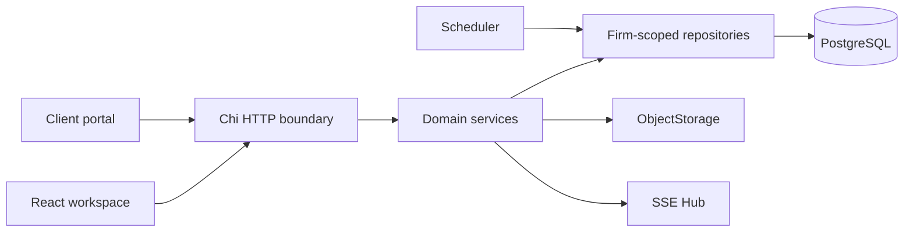

# Architecture

Rendered views of the main application surfaces are available in [Frontend interface](interface.md).

## Modular monolith

LawOffice OS is one deployable Go API organized by domain boundaries rather than a network of microservices. Identity, branding, clients, Matters, documents, deadlines, workflow, archive, search, finance, portal and audit share one transaction boundary and PostgreSQL source of truth. This keeps V0.1 operationally understandable while preserving module-level seams.

## Backend

Handlers decode bounded input and translate errors. Services enforce cross-resource rules such as Matter authorization and upload policy. Repositories own SQL and always receive `firmID`. Authentication middleware resolves a server-side session into a user plus roles/permissions. Domain objects remain independent of HTTP presentation.

The scheduler is one cancellation-aware goroutine for the entire process, not one goroutine per deadline. Each cycle takes a PostgreSQL transaction-scoped advisory lock, so only one API replica scans near-term deadlines/tasks while idempotent inserts provide a second safety layer. SIGINT/SIGTERM cancels the scheduler, closes SSE, drains HTTP and then closes PostgreSQL.

Outbound e-mail uses a separate PostgreSQL-backed worker. Atomic `SKIP LOCKED` claims allow multiple replicas, abandoned leases are reclaimed, and bounded retry ends in a terminal state. Stable deduplication keys coordinate opt-in deadline/task alerts across instances. Sensitive payloads are encrypted before insertion and removed when processing ends.

Document OCR/text extraction is another cancellation-aware worker, but uses dedicated relational jobs because its page output is durable domain data rather than an outbound message. A trigger creates one extraction per immutable version. Workers open opaque object keys only after a database claim, validate provider output and commit all pages atomically. The HTTP API repeats document and Matter authorization before exposing any extracted text.

Successful extraction also rebuilds version/page-aware chunks. PostgreSQL full-text search is the baseline retrieval path. When AI is enabled, a separate leased worker computes embeddings and the Matter AI Workspace performs bounded hybrid reranking in Go. Retrieval repeats firm and Matter authorization before any source text can leave the database. The provider adapter receives only selected excerpts, is time/size bounded and the application does not persist prompts or answers.

## Frontend

React Router separates public login/setup, protected `/app` routes and `/portal`. An authentication context loads the user, firm and branding. CSS variables apply the firm palette. The app layout owns desktop navigation, mobile navigation, global search, quick create and the Ctrl/Cmd+K command palette. Feature pages handle loading, empty, error and populated states.

## Database and storage

PostgreSQL holds relational state and authorization relationships. Composite `(id, firm_id)` constraints prevent cross-firm relationships. Binary documents are stored through `ObjectStorage`; only immutable version metadata and a current-version pointer live in PostgreSQL. Local filesystem and S3-compatible adapters share this boundary. Optional fail-closed ClamAV streaming happens before object commit and participates in readiness when configured as required.

## SSE and failure modes

SSE delivers notification, timeline and task events with event IDs and heartbeats. Publication writes `realtime_events` and calls `pg_notify` in the same PostgreSQL transaction, so other replicas only receive committed events. A reconnect carrying `Last-Event-ID` can replay up to 500 firm-scoped events from the seven-day durable window even when routed to another instance. Live delivery may be duplicated around the replay boundary; the HTTP stream suppresses IDs already sent. When durable publication fails, the API records an error and falls back to local delivery, while clients can still refetch authoritative domain state. A database outage fails readiness and data operations. A storage outage fails readiness and document operations but does not redefine PostgreSQL as file storage.

## Future scale

The next scale boundaries are a permission-aware vector index behind the retrieval seam and separate worker deployments if OCR/embedding volume grows. These can evolve without splitting every domain into a service.
