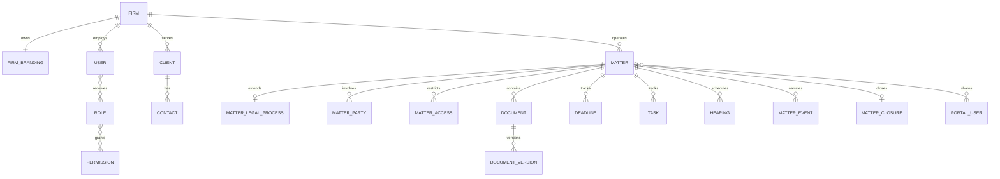

# Domain Model

The firm is the tenancy boundary and Matter is the legal-work aggregate. A judicial process is optional Matter detail, not the root entity.

- **Firm / FirmBranding:** identity, locale and white-label presentation.
- **User / Role / Permission:** internal identity and extensible RBAC.
- **Client / Contact / MatterParty:** represented entities and related people with explicit side/role.
- **Matter / MatterLegalProcess:** universal legal work plus litigation-specific detail.
- **MatterAccess:** user/role grants at read, write or manage level.
- **CustomFieldDefinition / Value and Tag:** moderate firm customization for clients and Matters.
- **Document / DocumentVersion / Folder:** stable metadata identity, immutable binaries and Matter organization.
- **Deadline / Task / Hearing / CalendarEvent:** operational commitments.
- **WorkflowDefinition / Stage / Transition / Instance:** configurable progression and declarative entry work.
- **MatterTemplate:** repeatable default legal structure.
- **MatterEvent / Note:** attributed timeline and private/team knowledge.
- **MatterClosure:** structured outcome and warnings retained at archive time.
- **MatterFinancialEntry:** operational money in integer cents.
- **PortalUser / PortalAccess:** separate external identity and explicit disclosure.
- **AuditEvent / Notification:** accountability and user attention.
